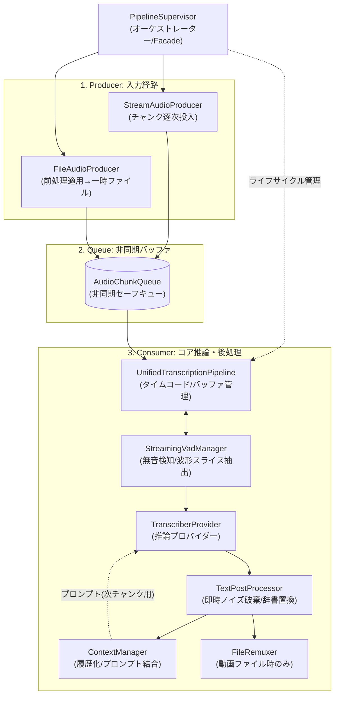
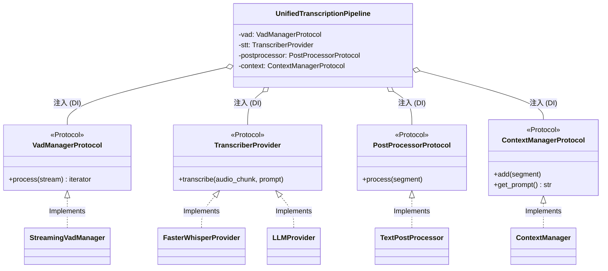

# Lumi Companion 音声処理ライブラリ拡張 詳細設計書

## 1. 概要と目的

本ドキュメントは、`lumi_companion`（るみぽん！）における要件仕様書 [AUDIO_LIBRARY_REQUIREMENTS.md](https://github.com/tk44fk40/lumi_companion/blob/issue-5/feat-gemini-provider-poc/docs/AUDIO_LIBRARY_REQUIREMENTS.md) に準拠し、`audio-transcriber` のアーキテクチャを設計するための技術設計書です。

本ライブラリは、ストリーミング入力（低遅延）とファイル入力（一括処理）の2つのユースケースをサポートしますが、**これらを分離せず、単一の「キューベース・リアルタイム進行アーキテクチャ」として完全統合**します。

---

## 2. アーキテクチャ構成（統合パイプライン）

入力経路である **Producer** (`StreamAudioProducer`, `FileAudioProducer`) のみをユースケースに応じて分離し、両者を繋ぐ **Queue** (`AudioChunkQueue`) 以降のコア推論・後処理を行う **Consumer** (`UnifiedTranscriptionPipeline`, `TranscriberProvider`, `TextPostProcessor` 等の一連のパイプライン) は完全に統一する設計とします。



### コア・パイプラインのDI（依存性注入）構造

パイプラインのデータフローとは独立して、コアである `UnifiedTranscriptionPipeline` は具体的な実装クラスには直接依存しません。以下のように各種インターフェース（Protocol）を定義し、外部（`PipelineSupervisor`等）からコンストラクタ経由で注入（DI）される設計となります。これにより各コンポーネントを独立してテスト・すり替え可能です。



---

## 3. 各機能の詳細仕様

### 3.1 エントリーポイントとエラー管理 (PipelineSupervisor)
* **目的**: CLIやライブラリ利用者が内部の複雑なキュー・スレッドを意識せず使える単一窓口（Facade）を提供し、システム全体の堅牢性を担保する。
* **仕様**:
  * **Facadeパターン**: CLIからは `supervisor.run_file(path)` や `supervisor.run_stream()` のように単一のメソッドを呼び出すだけで裏側の非同期パイプラインが進行する。
  * **全体例外管理**: ファイル破損、キュー詰まり(Timeout)、CUDA OOM 等の全タスクの例外をここで `try-except` で一括捕捉する。
  * **安全なシャットダウン**: エラー発生時は稼働中のタスクをキャンセルし、一時ファイルをクリーンアップし、コールバックでUI層へエラーを通知して安全に終了させる。

### 3.2 入力プロデューサーとキュー処理 (Producer & Queue)
* **目的**: 異なる入力ソースを同一のストリーム表現に変換し、メモリ消費を抑えながらコア・パイプライン（`UnifiedTranscriptionPipeline`）へ流し込む。
* **仕様**:
  * **ファイル入力 (FileAudioProducer)**: 設定に従い RNNoise 等で前処理を行い一時ファイルに出力する。その後、一時ファイルから音声を一定チャンクずつ読み込み `AudioChunkQueue` へ投入。
  * **ストリーム入力 (StreamAudioProducer)**: 外部から渡された音声をそのまま `AudioChunkQueue` へ投入。
  * **Backpressure制御**: ファイル読み込み速度が推論速度を上回るため、キューの最大サイズ (`maxsize`) を設定し、満杯時は Producer をブロックしてメモリの過剰消費（OOM）を防ぐ。

### 3.3 コア・パイプラインと波形スライス抽出 (Consumer & VAD)
* **目的**: チャンク単位の切り出しとタイムコードの正確な管理を行う。
* **仕様**:
  * **AudioRingBuffer**: パイプライン内に音声波形を一時蓄積するリングバッファを保持する。
  * **タイムコード管理**: 開始時に `start_timecode`（ファイル指定値、またはストリームなら0.0等）を受け取り、キューから取り出した累積時間から絶対時間を厳密に計算し続ける。
  * **波形のスライス抽出とメモリ解放**: VADが発話終端を検知した瞬間、VADが持つインデックスと同期し、リングバッファから「該当する開始位置〜終了位置の波形（numpy配列）」を正確にスライス抽出する。抽出済みの古いバッファは直ちに破棄しメモリを解放する。
  * 内蔵VADは使用せず（`vad_filter=False`）、この抽出波形を単一発話として推論コアへ引き渡す。

### 3.4 推論、補正、文脈管理の直列処理 (STT & PostProcessing)
* **目的**: 常駐型モデルによる低遅延推論と、推論後のハルシネーションを極小化し、後処理済みのクリーンな文脈を次の推論プロンプトとして活用する。
* **仕様**:
  * **推論コアの抽象化 (TranscriberProvider)**: 推論エンジンは特定のライブラリ（Faster-Whisper）に密結合させず、共通の `TranscriberProvider` インターフェース（Protocol）を実装する設計とする。これにより、ローカルで動く `FasterWhisperProvider`（常駐型）だけでなく、外部API（LLM等）を叩くプロバイダーやテスト用の `MockProvider` を自由にすり替え・注入（DI）可能とする。
  * **直列同期の待ち合わせ**: 抽出されたVADチャンクは、推論 ➔ 即時後処理（TextPostProcessor） ➔ 文脈追加（ContextManager） の順番で**完全に直列かつ同期的**に処理される。このサイクルが終わるまで次のVADチャンクの推論には入らない。
  * **即時後処理 (TextPostProcessor)**: Whisperが生テキストを返した直後に、以下の処理を順次適用して品質を担保する。
    1. **無音・無効破棄**: 無音確率（no_speech_prob）が閾値以上のものや、空テキストを除外。
    2. **重複（ハルシネーション）除去**: Whisper特有の無限ループや不自然な繰り返しを間引く。
    3. **カスタム辞書置換**: ユーザー定義辞書に基づき、固有名詞などを正しい表記へ置換。
    4. **正規化**: 英字の小文字化や不要な記号の削除（※漢数字等の正規化は行わない）。
    5. **タイミング補正**: 短すぎる字幕の表示時間確保や、余韻の付与（end_padding）。
  * **文脈管理 (ContextManager)**: 後処理済みの確定テキストを履歴として登録する。全体の文字数が上限を超過した場合は最古の文脈チャンクから破棄（FIFO）し、常に最適な `initial_prompt` を生成して次の推論（TranscriberProvider）へ渡す。
  * **疎結合設計の担保 (DIの活用)**: `UnifiedTranscriptionPipeline` が各コンポーネントの内部実装を知る（密結合になる）ことを防ぐため、`TranscriberProvider`、`StreamingVadManager`、`TextPostProcessor`、`ContextManager` などの**すべての依存コンポーネント**を共通のインターフェース（Protocol等）として定義し、外部（Supervisor等）からコンストラクタ注入（DI）する設計とします。パイプラインは単に「規定のインターフェースを呼び出すだけ」の純粋なオーケストレーターとして振る舞い、密結合は発生しません。

### 3.5 後処理・Remux
* **目的**: ファイル入力時の最終成果物の統合。
* **仕様**:
  * 入力が動画ファイルの場合、キューが空になり全チャンクの処理が完了した後、前処理済みの音声と文字起こし結果(SRT)を用いて元の動画ファイルの音声トラックを置き換える（REMUX）処理を行う。

---

## 4. インターフェースとデータモデルの標準化

* **出力タイミングと主体**: VADチャンクごとの処理が `TextPostProcessor` で完了した直後に、**コア・パイプライン (`UnifiedTranscriptionPipeline`)** がコールバックインターフェースを経由してイベントを発火し、外部（CLIのUI表示やSRTファイル保存等）に対して以下の `RecognizedSegment` データクラスを出力します。`PipelineSupervisor` はライフサイクルと例外管理のみを担い、データフローの出力には直接介入しません。

```python
from dataclasses import dataclass, field


@dataclass(frozen=True)
class RecognizedSegment:
    text: str  # 認識・後処理完了済みテキスト
    raw_text: str  # 辞書置換前のWhisper生テキスト
    start_time: float  # 発話開始時刻 (秒: オフセット加算後)
    end_time: float  # 発話終了時刻 (秒)
    confidence: float  # 認識信頼度スコア (0.0〜1.0)
    is_final: bool  # 確定セグメントフラグ
```

* **ステータスクリア機能（リセット）**: `PipelineSupervisor` は、内部リングバッファ、VADステート、履歴文脈等を即座に破棄・クリアできる `reset()` メソッドを提供する。

---

## 5. 耐障害性とテスト容易性

1. **CUDA OOM 耐性とリカバリ**: 前述の `PipelineSupervisor` 内で例外を安全に捕捉し、`on_error` コールバックへ通知。
2. **メトリクス通知**: 処理レイテンシや内部バッファの未処理残量を監視し、`on_metrics` コールバックを通じて定期通知する。
3. **推論エンジンのDI (プロバイダーパターン)**: 音声認識エンジンは `TranscriberProvider` インターフェースで実装。GPU環境の `FasterWhisperProvider` と、テスト環境用の `MockProvider` を容易に差し替えられる構造とする。
