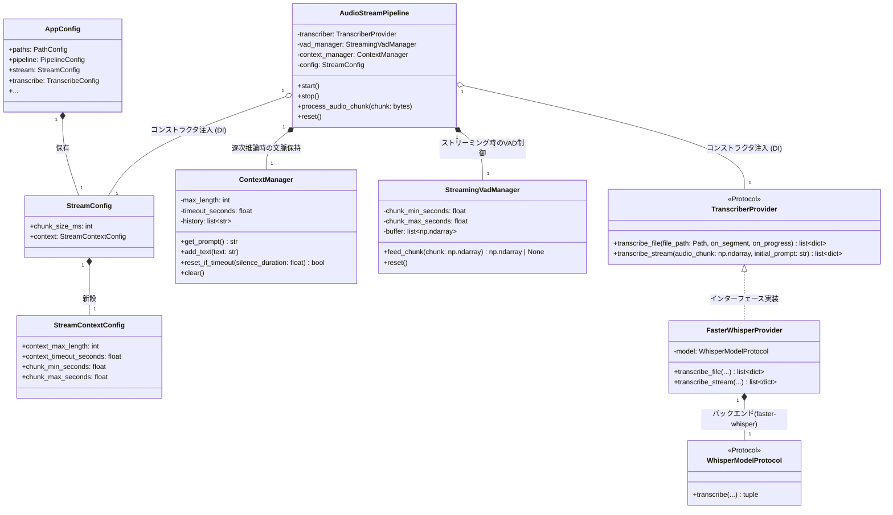

# Phase 11 ストリーミングアーキテクチャ クラス図

現在の `audio-transcriber` ライブラリにおいて、設定管理・ストリーミングパイプライン・推論エンジン・文脈・チャンク制御の各コンポーネントがどのように連携するかを整理したクラス図です。

## 各コンポーネントの責務分離（Phase 11 の要点）

1. **`AppConfig` と `StreamConfig`**:
   CLI引数やTOMLから読み込まれた値は全てこのデータクラス群に集約され、各パイプラインやモジュールの生成時に外から注入 (DI) されます。
2. **`AudioStreamPipeline` (全体オーケストレーター)**:
   ストリーミング入力の統括を行います。ここには複雑な音声処理のロジックは書かず、各マネージャーやプロバイダーを連携させる Facade として機能します。
3. **`StreamingVadManager` (チャンク制御)**:
   細かく入力されてくる音声チャンクを繋ぎ合わせ、Silero-VADの判定と `chunk_max_seconds` 等の制約に基づいて、「Whisperに渡すべき確定した発話チャンク (np.ndarray)」を切り出す責務のみを持ちます。
4. **`ContextManager` (文脈制御)**:
   ストリーミング特休の「過去の会話をどこまで記憶させるか（ハルシネーション対策）」を管理します。無音時間の長さや文字数上限によって、動的にプロンプト（`initial_prompt`）の長さを切り詰めたりリセットしたりします。
5. **`TranscriberProvider` (推論実行)**:
   純粋に「渡された音声（ファイルまたは波形チャンク）」を文字に変換する責務のみを持ちます。前処理や文脈の管理などは行わず、`transcribe_stream` では渡された `audio_chunk` と `initial_prompt` を元に推論を即座に実行します。
