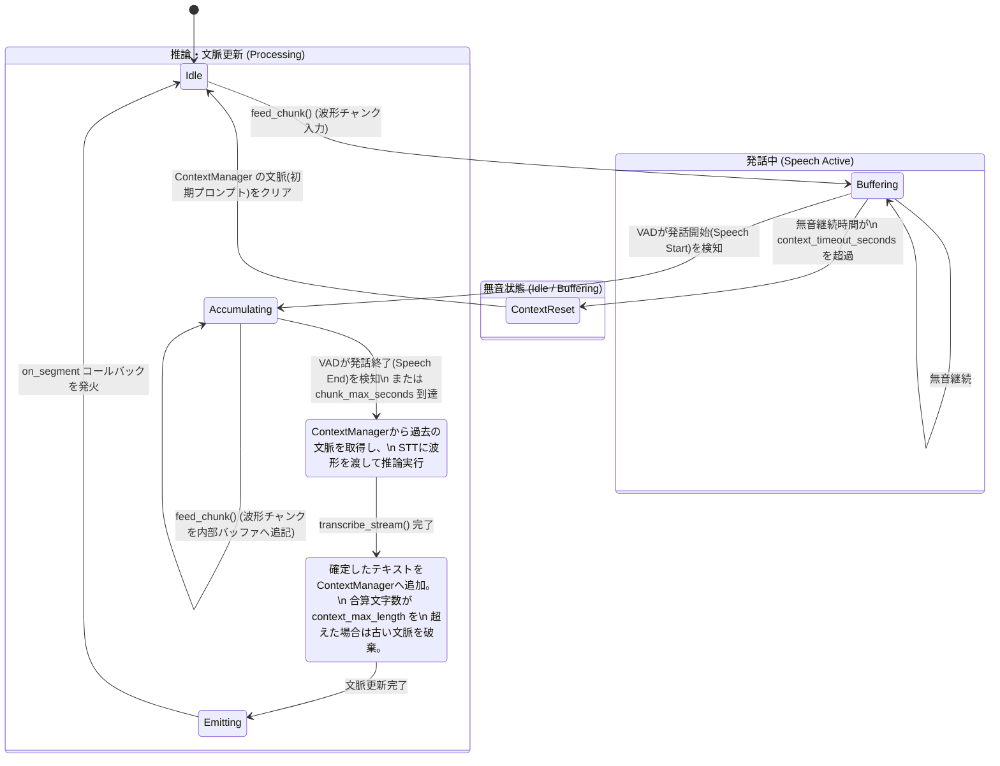

# Phase 11 ストリーミングアーキテクチャ フローチャート (Flowchart)

ストリーミング入力時に、音声チャンクの入力から VAD (音声区間検出)判定、推論、そして文脈（過去のプロンプト）の管理に至るまでの一連の動きを示す状態遷移図です。

## 各状態における動作のポイント

1. **タイムアウトによる幻覚（ハルシネーション）防止**:
   無音状態 (`Buffering`) が一定時間（例：3秒）続いた場合、会話が途切れたと判断して自動的に `ContextReset` が走り、過去の文脈を捨てます。これにより、別の話題に切り替わった際にWhisperが過去の文脈に引きずられて幻覚を生成するのを防ぎます。

2. **長短チャンクの強制保護**:
   発話中 (`Accumulating`) にVADが発話終了をなかなか検知しなくても、チャンク長が `chunk_max_seconds` (例：30秒) に達した場合は強制的に推論 (`Transcribing`) へ遷移します。これにより、出力の詰まりや Whisper の 30 秒制限によるエラーを回避します。

3. **動的な文脈の切り詰め**:
   推論完了後 (`UpdatingContext`)、新しいテキストを文脈に追加します。この時、文脈の合計文字数が上限（例：200文字）を超えていれば、上限に収まるまで「一番古い確定テキスト」から順に破棄して長さを維持します。
