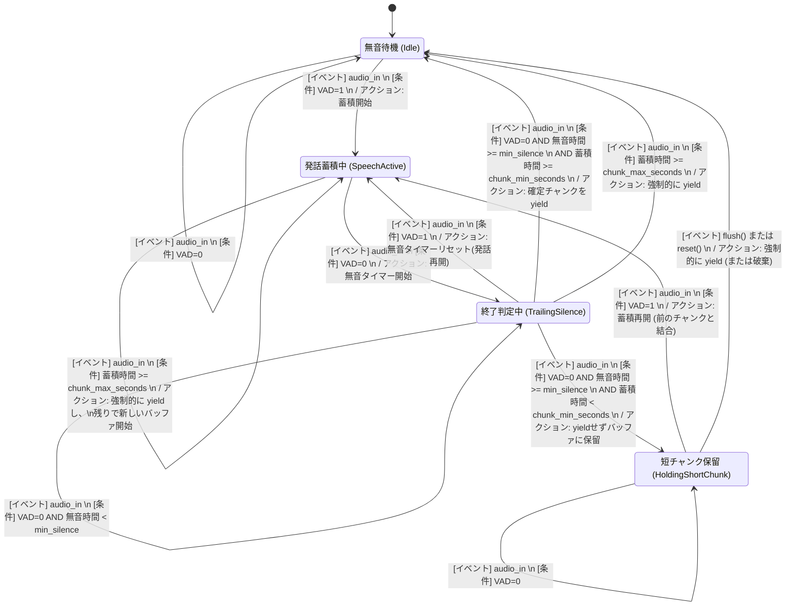
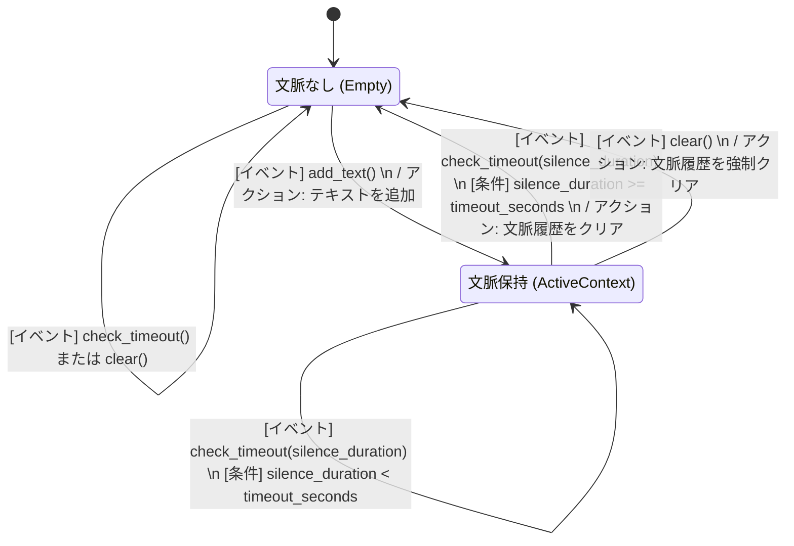

# Phase 11 ストリーミングアーキテクチャ 状態遷移図 (Statechart)

ストリーミングパイプラインを構成する各マネージャークラスの厳密な状態遷移図です。

## 補足: 図中の VAD=0 / VAD=1 について
図中に登場する「VAD」とは **Voice Activity Detection（音声区間検出）** の略称です。AIモデルが入力された短い音声チャンクを分析し、人の声が含まれているかを判定した結果を表します。

* **`VAD=1` (発話あり)**: 人の声が含まれていると判定された状態。システムは「発話中」と判断し、音声を蓄積します。
* **`VAD=0` (無音・声なし)**: 無音、または環境ノイズのみで人の声は含まれていないと判定された状態。話の合間の息継ぎや、発話の終了タイミングでこの値になります。

## 1. StreamingVadManager (チャンク制御) の状態遷移図
音声のチャンク入力を受け取り、発話区間を切り出して推論へ渡す役割を持つクラスです。`min_silence_duration` による発話終了の猶予と、`chunk_min_seconds` 未満の短い音声を保留・結合する状態を持ちます。

## 2. ContextManager (文脈管理) の状態遷移図
Whisperに渡す `initial_prompt`（過去の会話履歴）を保持・管理し、ハルシネーションを防ぐ役割を持つクラスです。文字数の上限到達時（Trim）や、パイプラインから渡される無音時間に基づくタイムアウト判定を行います。

